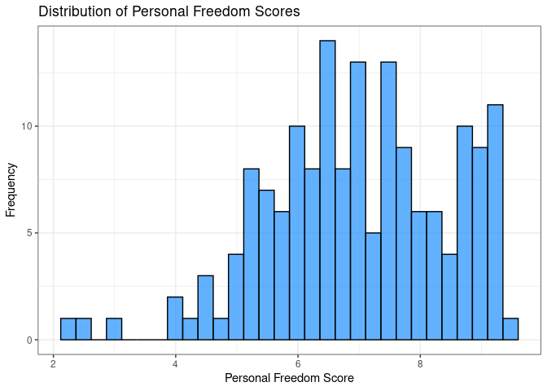
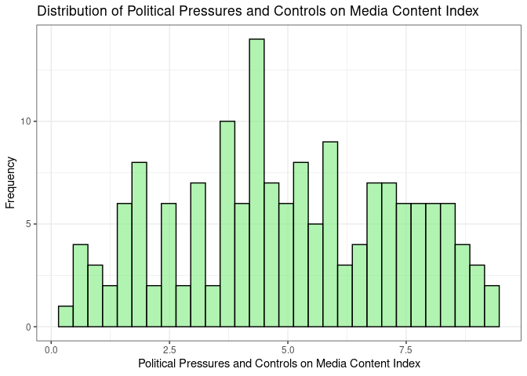
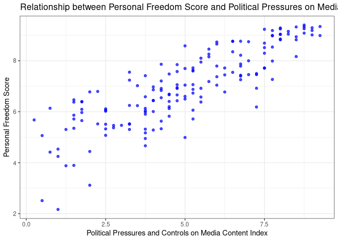
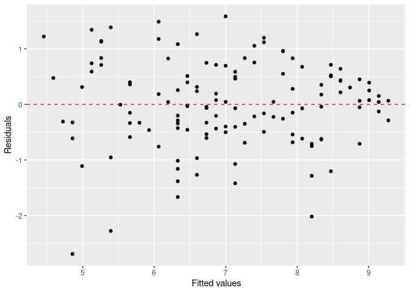
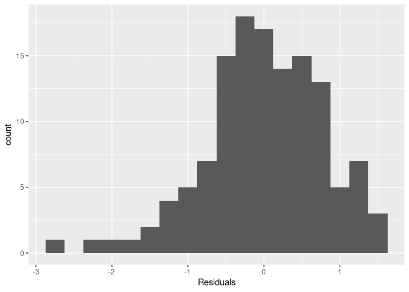

### A typical modeling process

The process that we will use for today's activity is:

1. Identify our research question(s),
2. Explore (graphically and with numerical summaries) the variables of interest - both individually and in relationship to one another,
3. Fit a simple linear regression model to obtain and describe model estimates,
4. Assess how "good" our model is, and
5. Predict new values.

We will continue to update/tweak/adapt this process and you are encouraged to build your own process.
Before we begin, we set up our R session and introduce this activity's data.

## Day 1

### The setup

We will be using two packages from Posit (formerly [RStudio](https://posit.co/)): `{tidyverse}` and `{tidymodels}`.
If you would like to try the *ISLR* labs using these two packages instead of base R, [Emil Hvitfeldt](https://www.emilhvitfeldt.com/) (of Posit) has put together a [complementary online text](https://emilhvitfeldt.github.io/ISLR-tidymodels-labs/index.html).

- In the **Packages** pane of RStudio (same area as **Files**), check to see if `{tidyverse}` and `{tidymodels}` are installed.
  Be sure to check both your **User Library** and **System Library**.
- If either of these are not currently listed, type the following in your **Console** pane, replacing `package_name` with the appropriate name, and  press Enter/Return afterwards.
  
  
  ```r
  # Note: the "eval = FALSE" in the above line tells R not to evaluate this code
  install.packages("package_name")
  ```
  
- Once you have verified that both `{tidyverse}` and `{tidymodels}` are installed, load these packages in the R chunk below titled `setup`.
  That is, type the following:
  
  
  ```r
  library(tidyverse)
  library(tidymodels)
  ```
  
- Run the `setup` code chunk and/or **knit**  icon your Rmd document to verify that no errors occur.


 **Check in**

Test your GitHub skills by staging, committing, and pushing your changes to GitHub and verify that your changes have been added to your GitHub repository.

### The data

The data we're working with is from the OpenIntro site: `https://www.openintro.org/data/csv/hfi.csv`.
Here is the "about" page: https://www.openintro.org/data/index.php?data=hfi.

In the R code chunk below titled `load-data`, you will type the code that reads in the above linked CSV file by doing the following:

- Rather than downloading this file, uploading to RStudio, then reading it in, explore how to load this file directly from the provided URL with `readr::read_csv` (`{readr}` is part of `{tidyverse}`).
- Assign this data set into a data frame named `hfi` (short for "Human Freedom Index").

After doing this and viewing the loaded data, answer the following questions:

1. What are the dimensions of the dataset?
  What does each row represent?

The dataset spans a lot of years.
We are only interested in data from year 2016.
In the R code chunk below titled `hfi-2016`, type the code that does the following:

- Filter the data `hfi` data frame for year 2016, and
- Assigns the result to a data frame named `hfi_2016`.


```r
#loading libraries
library(tidyverse)
```

```
## ── Attaching core tidyverse packages ──────────────────────── tidyverse 2.0.0 ──
## ✔ dplyr     1.1.2     ✔ readr     2.1.5
## ✔ forcats   1.0.0     ✔ stringr   1.5.0
## ✔ ggplot2   3.4.2     ✔ tibble    3.2.1
## ✔ lubridate 1.9.2     ✔ tidyr     1.3.0
## ✔ purrr     1.0.1     
## ── Conflicts ────────────────────────────────────────── tidyverse_conflicts() ──
## ✖ dplyr::filter() masks stats::filter()
## ✖ dplyr::lag()    masks stats::lag()
## ℹ Use the conflicted package (<http://conflicted.r-lib.org/>) to force all conflicts to become errors
```

```r
library(dplyr)
library(readr)
library(knitr)
library(skimr)
library(ggplot2)
library(broom)
library(ggpubr)
library(tidymodels)
```

```
## ── Attaching packages ────────────────────────────────────── tidymodels 1.1.0 ──
## ✔ dials        1.2.0     ✔ rsample      1.1.1
## ✔ infer        1.0.4     ✔ tune         1.1.1
## ✔ modeldata    1.1.0     ✔ workflows    1.1.3
## ✔ parsnip      1.1.0     ✔ workflowsets 1.0.1
## ✔ recipes      1.0.6     ✔ yardstick    1.2.0
## ── Conflicts ───────────────────────────────────────── tidymodels_conflicts() ──
## ✖ scales::discard() masks purrr::discard()
## ✖ dplyr::filter()   masks stats::filter()
## ✖ recipes::fixed()  masks stringr::fixed()
## ✖ dplyr::lag()      masks stats::lag()
## ✖ yardstick::spec() masks readr::spec()
## ✖ recipes::step()   masks stats::step()
## • Use tidymodels_prefer() to resolve common conflicts.
```

```r
#Checking for missing values#
```

## Data background
The Human Freedom Index is a report that attempts to summarize the idea of "freedom" through a bunch of different variables for many countries around the globe. It serves as a rough objective measure for the relationships between the different types of freedom - whether it's political, religious, economical or personal freedom - and other social and economic circumstances. The Human Freedom Index is an annually co-published report by the Cato Institute, the Fraser Institute, and the Liberales Institut at the Friedrich Naumann Foundation for Freedom.


### Importing the data

```r
hfi <- read.csv("hfi.csv")

#Filter the data fro 2016 only
hfi_2016 <- hfi %>% filter(year == 2016)
```

The data full `hfi` data set has `ncol(hfi)` columns and `nrow(hfi)` rows and when we retain the data for 2016 only we rain with `nrow(hfi_2016)` rows. 


```r
#Checking an overview of the data
hfi_2016%>%glimpse()
```

```
## Rows: 162
## Columns: 123
## $ year                               <int> 2016, 2016, 2016, 2016, 2016, 2016,…
## $ ISO_code                           <chr> "ALB", "DZA", "AGO", "ARG", "ARM", …
## $ countries                          <chr> "Albania", "Algeria", "Angola", "Ar…
## $ region                             <chr> "Eastern Europe", "Middle East & No…
## $ pf_rol_procedural                  <dbl> 6.661503, NA, NA, 7.098483, NA, 8.4…
## $ pf_rol_civil                       <dbl> 4.547244, NA, NA, 5.791960, NA, 7.5…
## $ pf_rol_criminal                    <dbl> 4.666508, NA, NA, 4.343930, NA, 7.3…
## $ pf_rol                             <dbl> 5.291752, 3.819566, 3.451814, 5.744…
## $ pf_ss_homicide                     <dbl> 8.920429, 9.456254, 8.060260, 7.622…
## $ pf_ss_disappearances_disap         <int> 10, 10, 5, 10, 10, 10, 10, 10, 10, …
## $ pf_ss_disappearances_violent       <dbl> 10.000000, 9.294030, 10.000000, 10.…
## $ pf_ss_disappearances_organized     <dbl> 10.0, 5.0, 7.5, 7.5, 7.5, 10.0, 10.…
## $ pf_ss_disappearances_fatalities    <dbl> 10.000000, 9.926119, 10.000000, 10.…
## $ pf_ss_disappearances_injuries      <dbl> 10.000000, 9.990149, 10.000000, 9.9…
## $ pf_ss_disappearances               <dbl> 10.000000, 8.842060, 8.500000, 9.49…
## $ pf_ss_women_fgm                    <dbl> 10.0, 10.0, 10.0, 10.0, 10.0, 10.0,…
## $ pf_ss_women_missing                <dbl> 7.5, 7.5, 10.0, 10.0, 5.0, 10.0, 10…
## $ pf_ss_women_inheritance_widows     <int> 5, 0, 5, 10, 10, 10, 10, 5, NA, 0, …
## $ pf_ss_women_inheritance_daughters  <int> 5, 0, 5, 10, 10, 10, 10, 10, NA, 0,…
## $ pf_ss_women_inheritance            <dbl> 5.0, 0.0, 5.0, 10.0, 10.0, 10.0, 10…
## $ pf_ss_women                        <dbl> 7.500000, 5.833333, 8.333333, 10.00…
## $ pf_ss                              <dbl> 8.806810, 8.043882, 8.297865, 9.040…
## $ pf_movement_domestic               <int> 5, 5, 0, 10, 5, 10, 10, 5, 10, 10, …
## $ pf_movement_foreign                <int> 10, 5, 5, 10, 5, 10, 10, 5, 10, 5, …
## $ pf_movement_women                  <int> 5, 5, 10, 10, 10, 10, 10, 5, NA, 5,…
## $ pf_movement                        <dbl> 6.666667, 5.000000, 5.000000, 10.00…
## $ pf_religion_estop_establish        <dbl> NA, NA, NA, NA, NA, NA, NA, NA, NA,…
## $ pf_religion_estop_operate          <dbl> NA, NA, NA, NA, NA, NA, NA, NA, NA,…
## $ pf_religion_estop                  <dbl> 10.0, 5.0, 10.0, 7.5, 5.0, 10.0, 10…
## $ pf_religion_harassment             <dbl> 9.566667, 6.873333, 8.904444, 9.037…
## $ pf_religion_restrictions           <dbl> 8.011111, 2.961111, 7.455556, 6.850…
## $ pf_religion                        <dbl> 9.192593, 4.944815, 8.786667, 7.795…
## $ pf_association_association         <dbl> 10.0, 5.0, 2.5, 7.5, 7.5, 10.0, 10.…
## $ pf_association_assembly            <dbl> 10.0, 5.0, 2.5, 10.0, 7.5, 10.0, 10…
## $ pf_association_political_establish <dbl> NA, NA, NA, NA, NA, NA, NA, NA, NA,…
## $ pf_association_political_operate   <dbl> NA, NA, NA, NA, NA, NA, NA, NA, NA,…
## $ pf_association_political           <dbl> 10.0, 5.0, 2.5, 5.0, 5.0, 10.0, 10.…
## $ pf_association_prof_establish      <dbl> NA, NA, NA, NA, NA, NA, NA, NA, NA,…
## $ pf_association_prof_operate        <dbl> NA, NA, NA, NA, NA, NA, NA, NA, NA,…
## $ pf_association_prof                <dbl> 10.0, 5.0, 5.0, 7.5, 5.0, 10.0, 10.…
## $ pf_association_sport_establish     <dbl> NA, NA, NA, NA, NA, NA, NA, NA, NA,…
## $ pf_association_sport_operate       <dbl> NA, NA, NA, NA, NA, NA, NA, NA, NA,…
## $ pf_association_sport               <dbl> 10.0, 5.0, 7.5, 7.5, 7.5, 10.0, 10.…
## $ pf_association                     <dbl> 10.0, 5.0, 4.0, 7.5, 6.5, 10.0, 10.…
## $ pf_expression_killed               <dbl> 10.000000, 10.000000, 10.000000, 10…
## $ pf_expression_jailed               <dbl> 10.000000, 10.000000, 10.000000, 10…
## $ pf_expression_influence            <dbl> 5.0000000, 2.6666667, 2.6666667, 5.…
## $ pf_expression_control              <dbl> 5.25, 4.00, 2.50, 5.50, 4.25, 7.75,…
## $ pf_expression_cable                <dbl> 10.0, 10.0, 7.5, 10.0, 7.5, 10.0, 1…
## $ pf_expression_newspapers           <dbl> 10.0, 7.5, 5.0, 10.0, 7.5, 10.0, 10…
## $ pf_expression_internet             <dbl> 10.0, 7.5, 7.5, 10.0, 7.5, 10.0, 10…
## $ pf_expression                      <dbl> 8.607143, 7.380952, 6.452381, 8.738…
## $ pf_identity_legal                  <int> 0, NA, 10, 10, 7, 7, 10, 0, NA, NA,…
## $ pf_identity_parental_marriage      <int> 10, 0, 10, 10, 10, 10, 10, 10, 10, …
## $ pf_identity_parental_divorce       <int> 10, 5, 10, 10, 10, 10, 10, 10, 10, …
## $ pf_identity_parental               <dbl> 10.0, 2.5, 10.0, 10.0, 10.0, 10.0, …
## $ pf_identity_sex_male               <int> 10, 0, 0, 10, 10, 10, 10, 10, 10, 1…
## $ pf_identity_sex_female             <int> 10, 0, 0, 10, 10, 10, 10, 10, 10, 1…
## $ pf_identity_sex                    <int> 10, 0, 0, 10, 10, 10, 10, 10, 10, 1…
## $ pf_identity_divorce                <int> 5, 0, 10, 10, 5, 10, 10, 5, NA, 0, …
## $ pf_identity                        <dbl> 6.2500000, 0.8333333, 7.5000000, 10…
## $ pf_score                           <dbl> 7.596281, 5.281772, 6.111324, 8.099…
## $ pf_rank                            <int> 57, 147, 117, 42, 84, 11, 8, 131, 6…
## $ ef_government_consumption          <dbl> 8.232353, 2.150000, 7.600000, 5.335…
## $ ef_government_transfers            <dbl> 7.509902, 7.817129, 8.886739, 6.048…
## $ ef_government_enterprises          <int> 8, 0, 0, 6, 8, 10, 10, 0, 7, 10, 7,…
## $ ef_government_tax_income           <int> 9, 7, 10, 7, 5, 5, 4, 9, 10, 10, 8,…
## $ ef_government_tax_payroll          <int> 7, 2, 9, 1, 5, 5, 3, 4, 10, 10, 8, …
## $ ef_government_tax                  <dbl> 8.0, 4.5, 9.5, 4.0, 5.0, 5.0, 3.5, …
## $ ef_government                      <dbl> 7.935564, 3.616782, 6.496685, 5.346…
## $ ef_legal_judicial                  <dbl> 2.6682218, 4.1867042, 1.8431292, 3.…
## $ ef_legal_courts                    <dbl> 3.145462, 4.327113, 1.974566, 2.930…
## $ ef_legal_protection                <dbl> 4.512228, 4.689952, 2.512364, 4.255…
## $ ef_legal_military                  <dbl> 8.333333, 4.166667, 3.333333, 7.500…
## $ ef_legal_integrity                 <dbl> 4.166667, 5.000000, 4.166667, 3.333…
## $ ef_legal_enforcement               <dbl> 4.3874441, 4.5075380, 2.3022004, 3.…
## $ ef_legal_restrictions              <dbl> 6.485287, 6.626692, 5.455882, 6.857…
## $ ef_legal_police                    <dbl> 6.933500, 6.136845, 3.016104, 3.385…
## $ ef_legal_crime                     <dbl> 6.215401, 6.737383, 4.291197, 4.133…
## $ ef_legal_gender                    <dbl> 0.9487179, 0.8205128, 0.8461538, 0.…
## $ ef_legal                           <dbl> 5.071814, 4.690743, 2.963635, 3.904…
## $ ef_money_growth                    <dbl> 8.986454, 6.955962, 9.385679, 5.233…
## $ ef_money_sd                        <dbl> 9.484575, 8.339152, 4.986742, 5.224…
## $ ef_money_inflation                 <dbl> 9.743600, 8.720460, 3.054000, 2.000…
## $ ef_money_currency                  <int> 10, 5, 5, 10, 10, 10, 10, 5, 0, 10,…
## $ ef_money                           <dbl> 9.553657, 7.253894, 5.606605, 5.614…
## $ ef_trade_tariffs_revenue           <dbl> 9.626667, 8.480000, 8.993333, 6.060…
## $ ef_trade_tariffs_mean              <dbl> 9.24, 6.22, 7.72, 7.26, 8.76, 9.50,…
## $ ef_trade_tariffs_sd                <dbl> 8.0240, 5.9176, 4.2544, 5.9448, 8.0…
## $ ef_trade_tariffs                   <dbl> 8.963556, 6.872533, 6.989244, 6.421…
## $ ef_trade_regulatory_nontariff      <dbl> 5.574481, 4.962589, 3.132738, 4.466…
## $ ef_trade_regulatory_compliance     <dbl> 9.4053278, 0.0000000, 0.9171598, 5.…
## $ ef_trade_regulatory                <dbl> 7.489905, 2.481294, 2.024949, 4.811…
## $ ef_trade_black                     <dbl> 10.00000, 5.56391, 10.00000, 0.0000…
## $ ef_trade_movement_foreign          <dbl> 6.306106, 3.664829, 2.946919, 5.358…
## $ ef_trade_movement_capital          <dbl> 4.6153846, 0.0000000, 3.0769231, 0.…
## $ ef_trade_movement_visit            <dbl> 8.2969231, 1.1062564, 0.1106256, 7.…
## $ ef_trade_movement                  <dbl> 6.406138, 1.590362, 2.044823, 4.697…
## $ ef_trade                           <dbl> 8.214900, 4.127025, 5.264754, 3.982…
## $ ef_regulation_credit_ownership     <int> 5, 0, 8, 5, 10, 10, 8, 5, 10, 10, 5…
## $ ef_regulation_credit_private       <dbl> 7.295687, 5.301526, 9.194715, 4.259…
## $ ef_regulation_credit_interest      <int> 9, 10, 4, 7, 10, 10, 10, 9, 10, 10,…
## $ ef_regulation_credit               <dbl> 7.098562, 5.100509, 7.064905, 5.419…
## $ ef_regulation_labor_minwage        <dbl> 5.566667, 5.566667, 8.900000, 2.766…
## $ ef_regulation_labor_firing         <dbl> 5.396399, 3.896912, 2.656198, 2.191…
## $ ef_regulation_labor_bargain        <dbl> 6.234861, 5.958321, 5.172987, 3.432…
## $ ef_regulation_labor_hours          <dbl> 8, 6, 4, 10, 10, 10, 6, 6, 8, 8, 10…
## $ ef_regulation_labor_dismissal      <dbl> 6.299741, 7.755176, 6.632764, 2.517…
## $ ef_regulation_labor_conscription   <int> 10, 1, 0, 10, 0, 10, 3, 1, 10, 10, …
## $ ef_regulation_labor                <dbl> 6.916278, 5.029513, 4.560325, 5.151…
## $ ef_regulation_business_adm         <dbl> 6.072172, 3.722341, 2.758428, 2.404…
## $ ef_regulation_business_bureaucracy <dbl> 6.000000, 1.777778, 1.333333, 6.666…
## $ ef_regulation_business_start       <dbl> 9.713864, 9.243070, 8.664627, 9.122…
## $ ef_regulation_business_bribes      <dbl> 4.050196, 3.765515, 1.945540, 3.260…
## $ ef_regulation_business_licensing   <dbl> 7.324582, 8.523503, 8.096776, 5.253…
## $ ef_regulation_business_compliance  <dbl> 7.074366, 7.029528, 6.782923, 6.508…
## $ ef_regulation_business             <dbl> 6.705863, 5.676956, 4.930271, 5.535…
## $ ef_regulation                      <dbl> 6.906901, 5.268992, 5.518500, 5.369…
## $ ef_score                           <dbl> 7.54, 4.99, 5.17, 4.84, 7.57, 7.98,…
## $ ef_rank                            <int> 34, 159, 155, 160, 29, 10, 27, 106,…
## $ hf_score                           <dbl> 7.568140, 5.135886, 5.640662, 6.469…
## $ hf_rank                            <int> 48, 155, 142, 107, 57, 4, 16, 130, …
## $ hf_quartile                        <int> 2, 4, 4, 3, 2, 1, 1, 4, 2, 2, 4, 2,…
```


### 1. Identify our research question(s)

The research question is often defined by you (or your company, boss, etc.).
Today's research question/goal is to predict a country's personal freedom score in 2016.

For this activity we want to explore the relationship between the personal freedom score, `pf_score`, and the political pressures and controls on media content index,`pf_expression_control`.
Specifically, we are going to use the political pressures and controls on media content index to predict a country's personal freedom score in 2016.

### 2. Explore the variables of interest

Answer the following questions (use your markdown skills) and complete the following tasks.

2. What type of plot would you use to display the distribution of the personal freedom scores, `pf_score`? 
Would this be the same type of plot to display the distribution of the political pressures and controls on media content index, `pf_expression_control`?


To display the distribution of the personal freedom scores `pf_score`, a histogram or a density plot can be used. Similarly, for the distribution of the political pressures and controls on media content index `pf_expression_control`, a histogram or a density plot would be appropriate.

Histograms are suitable for visualizing the distribution of a single variable, while density plots provide a smoothed version of the distribution and can be useful for comparing distributions of different variables.


- In the R code chunk below titled `univariable-plots`, type the R code that displays this plot for `pf_score`.
- In the R code chunk below titled `univariable-plots`, type the R code that displays this plot for `pf_expression_control`.


```r
# Plot for pf_score
hfi_2016 %>% ggplot(aes(x = pf_score)) +
  geom_histogram(fill = "dodgerblue", color = "black", alpha = 0.7) +
  labs(title = "Distribution of Personal Freedom Scores",
       x = "Personal Freedom Score",
       y = "Frequency") +
  theme_bw()
```

```
## `stat_bin()` using `bins = 30`. Pick better value with `binwidth`.
```

<!-- -->

```r
# Plot for pf_expression_control
hfi_2016 %>% ggplot(aes(x = pf_expression_control)) +
  geom_histogram(fill = "lightgreen", color = "black", alpha = 0.7) +
  labs(title = "Distribution of Political Pressures and Controls on Media Content Index",
       x = "Political Pressures and Controls on Media Content Index",
       y = "Frequency") +
  theme_bw()
```

```
## `stat_bin()` using `bins = 30`. Pick better value with `binwidth`.
```

<!-- -->


```r
# Mean, standard deviation, and median for pf_score
pf_score_mean <- mean(hfi_2016$pf_score)
pf_score_sd <- sd(hfi_2016$pf_score)
pf_score_median <- median(hfi_2016$pf_score)


# Mean, standard deviation, and median for pf_expression_control
pf_expression_control_mean <- mean(hfi_2016$pf_expression_control)
pf_expression_control_sd <- sd(hfi_2016$pf_expression_control)
pf_expression_control_median <- median(hfi_2016$pf_expression_control)

# Printing the results
cat("Personal Freedom Scores (pf_score):\n")
```

```
## Personal Freedom Scores (pf_score):
```

```r
cat("Mean:", pf_score_mean, "\n")
```

```
## Mean: 6.98468
```

```r
cat("Standard Deviation:", pf_score_sd, "\n")
```

```
## Standard Deviation: 1.490253
```

```r
cat("Median:", pf_score_median, "\n\n")
```

```
## Median: 6.931511
```

```r
cat("Political Pressures and Controls on Media Content Index (pf_expression_control):\n")
```

```
## Political Pressures and Controls on Media Content Index (pf_expression_control):
```

```r
cat("Mean:", pf_expression_control_mean, "\n")
```

```
## Mean: 4.984568
```

```r
cat("Standard Deviation:", pf_expression_control_sd, "\n")
```

```
## Standard Deviation: 2.324206
```

```r
cat("Median:", pf_expression_control_median, "\n")
```

```
## Median: 5
```


4. Comment on each of these two distributions. 
  Be sure to describe their centers, spread, shape, and any potential outliers.
  
The distribution of personal freedon score`pf_score` is left skewed with a mean of 6.98 and a standard deviation of 1.49. This means that is a small variance between personal freedom score and most people tend to have a higher score with a few outliers.

The distibution for political pressures and controls is almost normal with a mean of 4.98 and a standard deviation of 2.32. This means that there is a greater variance between the index of political pressures and controls on media. 


3. What type of plot would you use to display the relationship between the personal freedom score, `pf_score`, and the political pressures and controls on media content index,`pf_expression_control`?

To display the relationship between the personal freedom score `pf_score` and the political pressures and controls on media content index `pf_expression_control`, a scatter plot would be suitable. Scatter plots allow us to visualize the relationship between two continuous variables.


- In the R code chunk below titled `relationship-plot`, plot this relationship using the variable `pf_expression_control` as the predictor/explanatory variable.


```r
# Scatter plot for relationship between pf_score and pf_expression_control
hfi_2016 %>% ggplot(aes(x = pf_expression_control, y = pf_score)) +
  geom_point(color = "blue", alpha = 0.7) +
  labs(title = "Relationship between Personal Freedom Score and Political Pressures on Media Content",
       x = "Political Pressures and Controls on Media Content Index",
       y = "Personal Freedom Score") +
  theme_bw()
```

<!-- -->

4. Does the relationship look linear?
  If you knew a country's `pf_expression_control`, or its score out of 10, with 0 being the most, of political pressures and controls on media content, would you be comfortable using a linear model to predict the personal freedom score? 

Yes the relationship between `pf_score` and `pf_expression_control` is linear with an increasing trend, this means that an increase `pf_expression control` causes an increase in `pf_score`.

#### Challenge

For each plot and using your `{dplyr}` skills, obtain the appropriate numerical summary statistics and provide more detailed descriptions of these plots.
For example, in (4) you were asked to comment on the center, spread, shape, and potential outliers.
What measures could/should be used to describe these?
You might not know of one for each of those terms.

To provide more detailed descriptions of the plots and assess the center, spread, shape, and potential outliers, we can use various numerical summary statistics. 

- Center: We can use the mean, median, and mode to describe the central tendency of the distribution.
- Spread: Measures such as the range, interquartile range (IQR), standard deviation, and variance can describe the variability or spread of the data.
- Shape: We can assess the skewness and kurtosis of the distribution to describe its shape.
-Potential Outliers: We can identify outliers using measures such as the boxplot's whiskers (1.5 * IQR rule) or by examining observations that fall far from the mean or median.

What numerical summary would you use to describe the relationship between two numerical variables?
(hint: explore the `cor` function from Base R)

For describing the relationship between two numerical variables, we can use the Pearson correlation coefficient, which measures the strength and direction of the linear relationship between the variables. 


```r
library(dplyr)

# 1. Summary statistics for pf_score
pf_score_summary <- hfi_2016 %>%
  summarize(
    mean_pf_score = mean(pf_score),
    median_pf_score = median(pf_score),
    sd_pf_score = sd(pf_score),
    min_pf_score = min(pf_score),
    max_pf_score = max(pf_score)
  )

# 2. Summary statistics for pf_expression_control
pf_expression_control_summary <- hfi_2016 %>%
  summarize(
    mean_pf_expression_control = mean(pf_expression_control),
    median_pf_expression_control = median(pf_expression_control),
    sd_pf_expression_control = sd(pf_expression_control),
    min_pf_expression_control = min(pf_expression_control),
    max_pf_expression_control = max(pf_expression_control)
  )

# 3. Correlation between pf_score and pf_expression_control
correlation <- cor(hfi_2016$pf_score, hfi_2016$pf_expression_control)
```


### 3. Fit a simple linear regression model

Regardless of your response to (4), we will continue fitting a simple linear regression (SLR) model to these data.
The code that we will be using to fit statistical models in this course use `{tidymodels}` - an opinionated way to fit models in R - and this is likely new to most of you.
I will provide you with example code when I do not think you should know what to do - i.e., anything `{tidymodels}` related.

To begin, we will create a `{parsnip}` specification for a linear model.

- In the code chunk below titled `parsnip-spec`, replace "verbatim" with "r" just before the code chunk title.


```r
library(parsnip)
lm_spec <- linear_reg() %>%
  set_mode("regression") %>%
  set_engine("lm")

lm_spec
```

```
## Linear Regression Model Specification (regression)
## 
## Computational engine: lm
```

Note that the `set_mode("regression")` is really unnecessary/redundant as linear models (`"lm"`) can only be regression models.
It is better to be explicit as we get comfortable with this new process.
Remember that you can type `?function_name` in the R **Console** to explore a function's help documentation.

The above code also outputs the `lm_spec` output.
This code does not do any calculations by itself, but rather specifies what we plan to do.

Using this specification, we can now fit our model: $\texttt{pf\score} = \beta_0 + \beta_1 \times \texttt{pf\_expression\_control} + \varepsilon$.
Note, the "$" portion in the previous sentence is LaTeX snytex which is a math scripting (and other scripting) language.
I do not expect you to know this, but you will become more comfortable with this.
Look at your knitted document to see how this syntax appears.

- In the code chunk below titled `fit-lm`, replace "verbatim" with "r" just before the code chunk title. 


```r
slr_mod <- lm_spec %>% 
  fit(pf_score ~ pf_expression_control, data = hfi_2016)

tidy(slr_mod)
```

```
## # A tibble: 2 × 5
##   term                  estimate std.error statistic  p.value
##   <chr>                    <dbl>     <dbl>     <dbl>    <dbl>
## 1 (Intercept)              4.28     0.149       28.8 4.23e-65
## 2 pf_expression_control    0.542    0.0271      20.0 2.31e-45
```

The above code fits our SLR model, then provides a `tidy` parameter estimates table.

5. Using the `tidy` output, update the below formula with the estimated parameters.
  That is, replace "intercept" and "slope" with the appropriate values

$$
\hat{\texttt{pf\score}} = 4.284 + 0.542 \times \texttt{pf\_expression\_control}
$$


6. Interpret each of the estimated parameters from (5) in the context of this research question.
  That is, what do these values represent?

## Day 2

Hopefully, you were able to interpret the SLR model parameter estimates (i.e., the *y*-intercept and slope) as follows:

For countries with a `pf_expression_control` of 0 (those with the largest amount of political pressure on media content), we expect their mean personal freedom score to be 4.28.

For every 1 unit increase in `pf_expression_control` (political pressure on media content index), we expect a country's mean personal freedom score to increase 0.542 units.

### 4. Assessing

#### 4.A: Assess with your Day 1 model
  
To assess our model fit, we can use $R^2$ (the coefficient of determination), the proportion of variability in the response variable that is explained by the explanatory variable.
We use `glance` from  `{broom}` (which is automatically loaded with `{tidymodels}` - `{broom}` is also where `tidy` is from) to access this information.

- In the code chunk below titled `glance-lm`, replace "verbatim" with "r" just before the code chunk title. 


```r
glance(slr_mod)
```

```
## # A tibble: 1 × 12
##   r.squared adj.r.squared sigma statistic  p.value    df logLik   AIC   BIC
##       <dbl>         <dbl> <dbl>     <dbl>    <dbl> <dbl>  <dbl> <dbl> <dbl>
## 1     0.714         0.712 0.799      400. 2.31e-45     1  -193.  391.  400.
## # ℹ 3 more variables: deviance <dbl>, df.residual <int>, nobs <int>
```

After doing this and running the code, answer the following questions:

7. What is the value of $R^2$ for this model?
The $R^2$ of this model is 0.714.


8. What does this value mean in the context of this model?
  Think about what would a "good" value of $R^2$ would be?
  Can/should this value be "perfect"?

71% of the variance in `pf_score` can be explained by `pf_expression_control`. This means that the model fits the data fairly well.

#### 4.B: Assess with test/train

You previously fit a model and evaluated it using the exact same data.
This is a bit of circular reasoning and does not provide much information about the model's performance.
Now we will work through the test/train process of fitting and assessing a simple linear regression model.

Using the `diamonds` example provided to you in the Day 2 `README`, do the following

- Create a new R code chunk and provide it with a descriptive tile (e.g., `train-test`).
- Set a seed.
- Create an initial 80-20 split of the `hfi_2016` dataset
- Using your initial split R object, assign the two splits into a training R object and a testing R object.


```r
# Set seed for reproducibility
set.seed(123)

# Create initial 80-20 split of the hfi_2016 dataset
split <- initial_split(hfi_2016, prop = 0.8, strata = NULL)

# Assign the two splits into a training R object and a testing R object
train_data <- training(split)
test_data <- testing(split)
```


Now, you will use your training dataset to fit a SLR model.

- In the code chunk below titled `train-fit-lm`, replace "verbatim" with "r" just before the code chunk title and update the data set to your training R object you just created.


```r
slr_train <- lm_spec %>% 
  fit(pf_score ~ pf_expression_control, data = train_data)

tidy(slr_train)
```

```
## # A tibble: 2 × 5
##   term                  estimate std.error statistic  p.value
##   <chr>                    <dbl>     <dbl>     <dbl>    <dbl>
## 1 (Intercept)              4.32     0.166       26.1 7.85e-53
## 2 pf_expression_control    0.536    0.0299      17.9 1.41e-36
```

Notice that you can reuse the `lm_spec` specification because we are still doing a linear model.

9. Using the `tidy` output, update the below formula with the estimated parameters.
  That is, replace "intercept" and "slope" with the appropriate values

$$
\hat{\texttt{pf\score}} = 4.321 + 0.536 \times \texttt{pf\_expression\_control}
$$


10. Interpret each of the estimated parameters from (10) in the context of this research question.
  That is, what do these values represent?
  

For countries with a `pf_expression_control` of 0 (those with the largest amount of political pressure on media content), we expect their mean personal freedom score to be 4.321.


For every 1 unit increase in `pf_expression_control` (political pressure on media content index), we expect a country's mean personal freedom score to increase 0.536 units.

Now we will assess using the testing data set.

- In the code chunk below titled `train-fit-lm`, replace "verbatim" with "r" just before the code chunk title and update `data_test` to whatever R object you assigned your testing data to above.
  

```r
test_aug <- augment(slr_train, new_data = test_data)
glimpse(test_aug)
```

```
## Rows: 33
## Columns: 125
## $ year                               <int> 2016, 2016, 2016, 2016, 2016, 2016,…
## $ ISO_code                           <chr> "DZA", "AGO", "BHR", "BLZ", "BOL", …
## $ countries                          <chr> "Algeria", "Angola", "Bahrain", "Be…
## $ region                             <chr> "Middle East & North Africa", "Sub-…
## $ pf_rol_procedural                  <dbl> NA, NA, NA, 4.753383, 3.702869, 5.3…
## $ pf_rol_civil                       <dbl> NA, NA, NA, 4.737766, 3.361331, 6.0…
## $ pf_rol_criminal                    <dbl> NA, NA, NA, 3.315467, 2.090006, 5.5…
## $ pf_rol                             <dbl> 3.819566, 3.451814, 5.900339, 4.268…
## $ pf_ss_homicide                     <dbl> 9.456254, 8.060260, 9.790481, 0.000…
## $ pf_ss_disappearances_disap         <int> 10, 5, 10, 10, 10, 10, 10, 10, 0, 0…
## $ pf_ss_disappearances_violent       <dbl> 9.294030, 10.000000, 10.000000, 10.…
## $ pf_ss_disappearances_organized     <dbl> 5.0, 7.5, 2.5, NA, 7.5, 10.0, 10.0,…
## $ pf_ss_disappearances_fatalities    <dbl> 9.926119, 10.000000, 9.766110, 10.0…
## $ pf_ss_disappearances_injuries      <dbl> 9.990149, 10.000000, 9.719332, 10.0…
## $ pf_ss_disappearances               <dbl> 8.842060, 8.500000, 8.397088, 10.00…
## $ pf_ss_women_fgm                    <dbl> 10.0, 10.0, 10.0, NA, 10.0, 10.0, 1…
## $ pf_ss_women_missing                <dbl> 7.5, 10.0, 7.5, NA, 10.0, 7.5, 10.0…
## $ pf_ss_women_inheritance_widows     <int> 0, 5, 0, 10, 5, 5, 10, NA, 5, 0, 5,…
## $ pf_ss_women_inheritance_daughters  <int> 0, 5, 0, 10, 5, 5, 10, NA, 5, 0, 5,…
## $ pf_ss_women_inheritance            <dbl> 0.0, 5.0, 0.0, 10.0, 5.0, 5.0, 10.0…
## $ pf_ss_women                        <dbl> 5.833333, 8.333333, 5.833333, 10.00…
## $ pf_ss                              <dbl> 8.043882, 8.297865, 8.006968, 6.666…
## $ pf_movement_domestic               <int> 5, 0, 10, 10, 10, 10, 10, 10, 0, 5,…
## $ pf_movement_foreign                <int> 5, 5, 5, 10, 10, 10, 10, 10, 0, 0, …
## $ pf_movement_women                  <int> 5, 10, 5, NA, 10, 5, 10, NA, 10, 0,…
## $ pf_movement                        <dbl> 5.000000, 5.000000, 6.666667, 10.00…
## $ pf_religion_estop_establish        <dbl> NA, NA, NA, NA, NA, NA, NA, NA, NA,…
## $ pf_religion_estop_operate          <dbl> NA, NA, NA, NA, NA, NA, NA, NA, NA,…
## $ pf_religion_estop                  <dbl> 5.0, 10.0, 10.0, NA, 7.5, NA, 10.0,…
## $ pf_religion_harassment             <dbl> 6.873333, 8.904444, 8.362222, 9.593…
## $ pf_religion_restrictions           <dbl> 2.961111, 7.455556, 4.022222, 8.516…
## $ pf_religion                        <dbl> 4.944815, 8.786667, 7.461481, 9.055…
## $ pf_association_association         <dbl> 5.0, 2.5, 5.0, NA, 7.5, NA, 10.0, N…
## $ pf_association_assembly            <dbl> 5.0, 2.5, 0.0, NA, 7.5, NA, 10.0, N…
## $ pf_association_political_establish <dbl> NA, NA, NA, NA, NA, NA, NA, NA, NA,…
## $ pf_association_political_operate   <dbl> NA, NA, NA, NA, NA, NA, NA, NA, NA,…
## $ pf_association_political           <dbl> 5.0, 2.5, 0.0, NA, 5.0, NA, 10.0, N…
## $ pf_association_prof_establish      <dbl> NA, NA, NA, NA, NA, NA, NA, NA, NA,…
## $ pf_association_prof_operate        <dbl> NA, NA, NA, NA, NA, NA, NA, NA, NA,…
## $ pf_association_prof                <dbl> 5.0, 5.0, 10.0, NA, 5.0, NA, 10.0, …
## $ pf_association_sport_establish     <dbl> NA, NA, NA, NA, NA, NA, NA, NA, NA,…
## $ pf_association_sport_operate       <dbl> NA, NA, NA, NA, NA, NA, NA, NA, NA,…
## $ pf_association_sport               <dbl> 5.0, 7.5, 10.0, NA, 7.5, NA, 10.0, …
## $ pf_association                     <dbl> 5.0, 4.0, 5.0, NA, 6.5, NA, 10.0, N…
## $ pf_expression_killed               <dbl> 10.000000, 10.000000, 10.000000, 10…
## $ pf_expression_jailed               <dbl> 10.000000, 10.000000, 0.000000, 10.…
## $ pf_expression_influence            <dbl> 2.6666667, 2.6666667, 0.6666667, 7.…
## $ pf_expression_control              <dbl> 4.00, 2.50, 0.75, 6.75, 4.25, 5.25,…
## $ pf_expression_cable                <dbl> 10.0, 7.5, 7.5, NA, 10.0, NA, 10.0,…
## $ pf_expression_newspapers           <dbl> 7.5, 5.0, 7.5, NA, 10.0, NA, 10.0, …
## $ pf_expression_internet             <dbl> 7.5, 7.5, 2.5, NA, 10.0, NA, 10.0, …
## $ pf_expression                      <dbl> 7.380952, 6.452381, 4.130952, 8.520…
## $ pf_identity_legal                  <int> NA, 10, NA, NA, 10, 7, 7, NA, 7, NA…
## $ pf_identity_parental_marriage      <int> 0, 10, 0, 10, 10, 5, 10, NA, 10, 0,…
## $ pf_identity_parental_divorce       <int> 5, 10, 0, 10, 10, 5, 10, NA, 10, 0,…
## $ pf_identity_parental               <dbl> 2.5, 10.0, 0.0, 10.0, 10.0, 5.0, 10…
## $ pf_identity_sex_male               <int> 0, 0, 10, 10, 10, 0, 10, 10, 10, 0,…
## $ pf_identity_sex_female             <int> 0, 0, 10, 10, 10, 0, 10, 10, 10, 0,…
## $ pf_identity_sex                    <int> 0, 0, 10, 10, 10, 0, 10, 10, 10, 0,…
## $ pf_identity_divorce                <int> 0, 10, 0, NA, 10, 5, 10, NA, 10, 0,…
## $ pf_identity                        <dbl> 0.8333333, 7.5000000, 3.3333333, 10…
## $ pf_score                           <dbl> 5.281772, 6.111324, 6.136070, 7.430…
## $ pf_rank                            <int> 147, 117, 114, 66, 73, 86, 12, 44, …
## $ ef_government_consumption          <dbl> 2.150000, 7.600000, 3.688235, 6.632…
## $ ef_government_transfers            <dbl> 7.817129, 8.886739, 9.581704, 8.431…
## $ ef_government_enterprises          <int> 0, 0, 10, 4, 0, 7, 8, 0, 2, 2, 6, 1…
## $ ef_government_tax_income           <int> 7, 10, 10, 9, 10, 9, 5, 8, 6, 9, 5,…
## $ ef_government_tax_payroll          <int> 2, 9, 10, NA, 10, 9, 5, 4, 6, 5, 5,…
## $ ef_government_tax                  <dbl> 4.5, 9.5, 10.0, 9.0, 10.0, 9.0, 5.0…
## $ ef_government                      <dbl> 3.616782, 6.496685, 8.317485, 7.015…
## $ ef_legal_judicial                  <dbl> 4.1867042, 1.8431292, 6.8225630, 8.…
## $ ef_legal_courts                    <dbl> 4.327113, 1.974566, 6.231401, 4.200…
## $ ef_legal_protection                <dbl> 4.689952, 2.512364, 7.435713, 7.385…
## $ ef_legal_military                  <dbl> 4.1666667, 3.3333333, 5.0000000, 6.…
## $ ef_legal_integrity                 <dbl> 5.000000, 4.166667, 7.500000, NA, 4…
## $ ef_legal_enforcement               <dbl> 4.507538, 2.302200, 4.785814, 3.329…
## $ ef_legal_restrictions              <dbl> 6.626692, 5.455882, 8.855315, 7.288…
## $ ef_legal_police                    <dbl> 6.136845, 3.016104, 7.764706, 3.329…
## $ ef_legal_crime                     <dbl> 6.737383, 4.291197, 7.287250, 4.767…
## $ ef_legal_gender                    <dbl> 0.8205128, 0.8461538, 0.5365854, 0.…
## $ ef_legal                           <dbl> 4.690743, 2.963635, 5.265602, 5.137…
## $ ef_money_growth                    <dbl> 6.955962, 9.385679, 9.961596, 9.412…
## $ ef_money_sd                        <dbl> 8.339152, 4.986742, 8.215418, 9.545…
## $ ef_money_inflation                 <dbl> 8.720460, 3.054000, 9.440400, 9.860…
## $ ef_money_currency                  <int> 5, 5, 10, 0, 10, 10, 10, 5, 5, 10, …
## $ ef_money                           <dbl> 7.253894, 5.606605, 9.404353, 7.204…
## $ ef_trade_tariffs_revenue           <dbl> 8.480000, 8.993333, 9.480000, 7.073…
## $ ef_trade_tariffs_mean              <dbl> 6.22, 7.72, 9.06, 7.80, 7.66, 8.48,…
## $ ef_trade_tariffs_sd                <dbl> 5.9176, 4.2544, 7.0296, 4.9840, 6.3…
## $ ef_trade_tariffs                   <dbl> 6.872533, 6.989244, 8.523200, 6.619…
## $ ef_trade_regulatory_nontariff      <dbl> 4.962589, 3.132738, 6.712476, 7.922…
## $ ef_trade_regulatory_compliance     <dbl> 0.0000000, 0.9171598, 5.8787130, 5.…
## $ ef_trade_regulatory                <dbl> 2.481294, 2.024949, 6.295595, 6.873…
## $ ef_trade_black                     <dbl> 5.563910, 10.000000, 10.000000, 10.…
## $ ef_trade_movement_foreign          <dbl> 3.664829, 2.946919, 7.456232, 7.822…
## $ ef_trade_movement_capital          <dbl> 0.0000000, 3.0769231, 6.1538462, 0.…
## $ ef_trade_movement_visit            <dbl> 1.1062564, 0.1106256, 0.7743795, 6.…
## $ ef_trade_movement                  <dbl> 1.590362, 2.044823, 4.794819, 4.709…
## $ ef_trade                           <dbl> 4.127025, 5.264754, 7.403403, 7.050…
## $ ef_regulation_credit_ownership     <int> 0, 8, 10, 10, 8, 8, 10, NA, 2, 2, 1…
## $ ef_regulation_credit_private       <dbl> 5.3015259, 9.1947155, 2.8275013, 9.…
## $ ef_regulation_credit_interest      <int> 10, 4, 10, 10, 10, 9, 10, 10, 10, 1…
## $ ef_regulation_credit               <dbl> 5.100509, 7.064905, 7.609167, 9.947…
## $ ef_regulation_labor_minwage        <dbl> 5.566667, 8.900000, 8.333333, 7.766…
## $ ef_regulation_labor_firing         <dbl> 3.896912, 2.656198, 5.687467, 3.294…
## $ ef_regulation_labor_bargain        <dbl> 5.958321, 5.172987, 7.695706, 6.505…
## $ ef_regulation_labor_hours          <dbl> 6, 4, 8, 8, 8, 10, 8, 8, 10, 8, 10,…
## $ ef_regulation_labor_dismissal      <dbl> 7.7551762, 6.6327642, 0.0000000, 6.…
## $ ef_regulation_labor_conscription   <int> 1, 0, 10, 10, 3, 10, 10, 1, 0, 0, 1…
## $ ef_regulation_labor                <dbl> 5.029513, 4.560325, 6.619418, 7.018…
## $ ef_regulation_business_adm         <dbl> 3.722341, 2.758428, 6.084863, 3.039…
## $ ef_regulation_business_bureaucracy <dbl> 1.777778, 1.333333, 8.000000, 4.888…
## $ ef_regulation_business_start       <dbl> 9.243070, 8.664627, 9.675831, 8.259…
## $ ef_regulation_business_bribes      <dbl> 3.765515, 1.945540, 6.596745, 6.724…
## $ ef_regulation_business_licensing   <dbl> 8.523503, 8.096776, 8.074670, 8.843…
## $ ef_regulation_business_compliance  <dbl> 7.029528, 6.782923, 9.680534, 8.352…
## $ ef_regulation_business             <dbl> 5.676956, 4.930271, 8.018774, 6.684…
## $ ef_regulation                      <dbl> 5.268992, 5.518500, 7.415786, 7.883…
## $ ef_score                           <dbl> 4.99, 5.17, 7.56, 6.86, 6.23, 7.43,…
## $ ef_rank                            <int> 159, 155, 30, 83, 123, 44, 10, 93, …
## $ hf_score                           <dbl> 5.135886, 5.640662, 6.848035, 7.145…
## $ hf_rank                            <int> 155, 142, 75, 64, 92, 64, 5, 53, 13…
## $ hf_quartile                        <int> 4, 4, 2, 2, 3, 2, 1, 2, 4, 4, 2, 1,…
## $ .pred                              <dbl> 6.463470, 5.660036, 4.722697, 7.936…
## $ .resid                             <dbl> -1.18169745, 0.45128844, 1.41337330…
```


This takes your SLR model and applies it to your testing data.

 **Check in**

Look at the various information produced by this code.
Can you identify what each column represents?

The `.fitted` column in this output can also be obtained by using `predict` (i.e., `predict(slr_fit, new_data = data_test)`)

11. Now, using your responses to (7) and (8) as an example, assess how well your model fits your testing data.
  Compare your results here to your results from your Day 1 of this activity.
  Did this model perform any differently?


### Model diagnostics

To assess whether the linear model is reliable, we should check for (1) linearity, (2) nearly normal residuals, and (3) constant variability.
Note that the normal residuals is not really necessary for all models (sometimes we simply want to describe a relationship for the data that we have or population-level data, where statistical inference is not appropriate/necessary).

In order to do these checks we need access to the fitted (predicted) values and the residuals.
We can use `broom::augment` to calculate these.

- In the code chunk below titled `augment`, replace "verbatim" with "r" just before the code chunk title and update `data_test` to whatever R object you assigned your testing data to above. 
  

```r
train_aug <- augment(slr_train, new_data = train_data)
train_aug
```

```
## # A tibble: 129 × 125
##     year ISO_code countries      region           pf_rol_procedural pf_rol_civil
##    <int> <chr>    <chr>          <chr>                        <dbl>        <dbl>
##  1  2016 VNM      Vietnam        South Asia                    5.38         4.45
##  2  2016 BEL      Belgium        Western Europe                8.67         7.34
##  3  2016 FIN      Finland        Western Europe                9.50         7.96
##  4  2016 PER      Peru           Latin America &…              6.17         4.41
##  5  2016 DOM      Dominican Rep. Latin America &…              5.24         4.54
##  6  2016 ZMB      Zambia         Sub-Saharan Afr…              3.30         4.89
##  7  2016 ZWE      Zimbabwe       Sub-Saharan Afr…              2.43         4.33
##  8  2016 UKR      Ukraine        Eastern Europe                4.77         5.14
##  9  2016 MKD      Macedonia      Eastern Europe                4.68         5.63
## 10  2016 MDG      Madagascar     Sub-Saharan Afr…              3.33         3.93
## # ℹ 119 more rows
## # ℹ 119 more variables: pf_rol_criminal <dbl>, pf_rol <dbl>,
## #   pf_ss_homicide <dbl>, pf_ss_disappearances_disap <int>,
## #   pf_ss_disappearances_violent <dbl>, pf_ss_disappearances_organized <dbl>,
## #   pf_ss_disappearances_fatalities <dbl>, pf_ss_disappearances_injuries <dbl>,
## #   pf_ss_disappearances <dbl>, pf_ss_women_fgm <dbl>,
## #   pf_ss_women_missing <dbl>, pf_ss_women_inheritance_widows <int>, …
```


**Linearity**: You already checked if the relationship between `pf_score` and `pf_expression_control` is linear using a scatterplot.
We should also verify this condition with a plot of the residuals vs. fitted (predicted) values.

- In the code chunk below titled `fitted-residual`, replace "verbatim" with "r" just before the code chunk title. 
  

```r
ggplot(data = train_aug, aes(x = .pred, y = .resid)) +
  geom_point() +
  geom_hline(yintercept = 0, linetype = "dashed", color = "red") +
  xlab("Fitted values") +
  ylab("Residuals")
```

<!-- -->

Notice here that `train_aug` can also serve as a data set because stored within it are the fitted values ($\hat{y}$) and the residuals.
Also note that we are getting fancy with the code here.
After creating the scatterplot on the first layer (first line of code), we overlay a red horizontal dashed line at $y = 0$ (to help us check whether the residuals are distributed around 0), and we also rename the axis labels to be more informative.

Answer the following question:

11. Is there any apparent pattern in the residuals plot?
  What does this indicate about the linearity of the relationship between the two variables?
The assumption of linearity has been met as we can see that the points on the residual plot are randomly distributed and have no pattern.

**Nearly normal residuals**: To check this condition, we can look at a histogram of the residuals.

- In the code chunk below titled `residual-histogram`, replace "verbatim" with "r" just before the code chunk title. 
 

```r
ggplot(data = train_aug, aes(x = .resid)) +
  geom_histogram(binwidth = 0.25) +
  xlab("Residuals")
```

<!-- -->

Answer the following question:

12. Based on the histogram, does the nearly normal residuals condition appear to be violated?
  Why or why not?
 From the histogram above, it shows that the condition for normality has been violated, this can be seen by the shape of the histogram which does not have a bell shaped.


**Constant variability**:

13. Based on the residuals vs. fitted plot, does the constant variability condition appear to be violated?
  Why or why not?
The assumption of constant variance has been met. The points on the residual plots appear to be randomly distributed.


## Attribution

This document is based on labs from
[OpenIntro](https://www.openintro.org/).

<a rel="license" href="http://creativecommons.org/licenses/by-sa/4.0/"></a><br />This
work is licensed under a
<a rel="license" href="http://creativecommons.org/licenses/by-sa/4.0/">Creative
Commons Attribution-ShareAlike 4.0 International License</a>.
